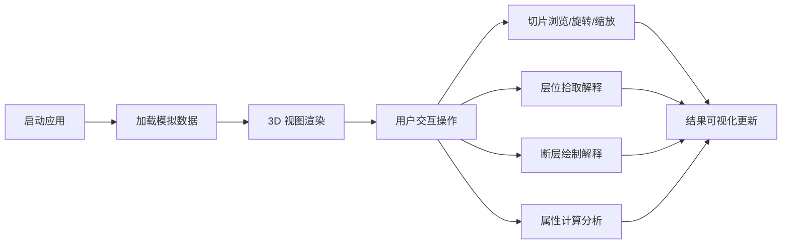

## 1. 产品概述

OpendTect Web 版是一款基于 Web 的地震数据解释与可视化平台，为地质学家、地球物理学家和油气勘探工程师提供在线的地震数据分析工具。
- 核心价值：将专业的地震解释工作流迁移到 Web 端，实现跨平台、随时随地的地震数据浏览与解释
- 目标用户：油气勘探从业者、地质研究人员、高校师生

## 2. 核心功能

### 2.1 用户角色
| 角色 | 注册方式 | 核心权限 |
|------|----------|----------|
| 普通用户 | 本地登录 | 浏览地震数据、使用解释工具、导入 SEGY 文件 |

### 2.2 功能模块
1. **主工作台**：菜单栏、工具栏、多视图面板、状态栏
2. **3D 地震可视化**：三维数据体渲染、切片浏览、透明度调节
3. **层位解释**：层位追踪、拾取点管理、层位曲面显示
4. **断层解释**：断层平面绘制、断距调节、断层组合
5. **属性分析**：振幅属性、相干体、曲率属性计算与显示
6. **数据管理**：SEGY 文件导入、模拟数据集、项目管理

### 2.3 页面详情
| 页面名称 | 模块名称 | 功能描述 |
|----------|----------|----------|
| 主工作台 | 菜单栏 | 文件、编辑、视图、工具、帮助等菜单 |
| 主工作台 | 工具栏 | 常用工具快捷按钮（选择、缩放、平移、旋转） |
| 主工作台 | 3D 视图区 | 主 3D 地震数据体渲染窗口 |
| 主工作台 | 剖面视图 | inline/crossline/time 三向剖面联动 |
| 主工作台 | 左侧面板 | 数据树、层位列表、断层列表 |
| 主工作台 | 右侧面板 | 属性面板、设置面板、图层控制 |
| 主工作台 | 状态栏 | 坐标信息、数据信息、操作提示 |
| 数据导入 | SEGY 导入 | 文件上传、道头解析、数据预览 |
| 属性分析 | 属性面板 | 属性选择、参数设置、结果预览 |

## 3. 核心流程

用户启动应用后，系统自动加载模拟地震数据集并在 3D 视图中渲染。用户可通过工具栏切换工具，进行数据浏览、层位解释、断层解释和属性分析等操作，所有操作结果实时可视化更新。

## 4. 用户界面设计

### 4.1 设计风格
- **主色调**：深色工业风，以深蓝灰 (#0f172a) 为底色，搭配专业蓝 (#3b82f6) 作为强调色
- **辅助色**：地震数据彩虹色带 (seismic colormap)、层位暖色系、断层冷色系
- **按钮风格**：扁平化设计，微妙的 hover 效果，图标+文字组合
- **字体**：JetBrains Mono (等宽) + Inter (无衬线)，专业工程软件感
- **布局风格**：多面板可拖拽布局，类似传统桌面专业软件 (Docking UI)
- **图标风格**：Lucide 线性图标，简洁专业

### 4.2 页面设计概览
| 页面名称 | 模块名称 | UI 元素 |
|----------|----------|----------|
| 主工作台 | 菜单栏 | 深色背景、白色文字、下拉菜单、快捷键提示 |
| 主工作台 | 工具栏 | 图标按钮组、分隔线、工具选中高亮 |
| 主工作台 | 3D 视图区 | 全屏 Canvas、黑色背景、坐标轴指示器、操作提示 |
| 主工作台 | 剖面视图 | 三向联动、彩色色带、比例尺、坐标标注 |
| 主工作台 | 侧面板 | 可折叠、标签页、树状列表、滑块控件 |
| 主工作台 | 状态栏 | 分栏信息、实时坐标、内存占用 |

### 4.3 响应式
- 桌面端优先设计，最低支持 1280x800 分辨率
- 侧面板可折叠以适应小屏幕
- 工具栏自适应宽度，溢出项收入更多菜单

### 4.4 3D 场景指引
- **环境**：纯黑背景，模拟专业可视化软件风格，无 HDRI
- **光照**：环境光 + 方向光，确保数据体各面清晰可见
- **相机**：透视相机，支持轨道控制（旋转、缩放、平移）
- **组成**：中心数据体 + 左下角坐标轴 + 右下角色标
- **交互**：鼠标左键旋转、右键平移、滚轮缩放
- **后处理**：轻微泛光效果增强科技感
- **性能**：使用纹理切片法渲染数据体，目标 60fps
