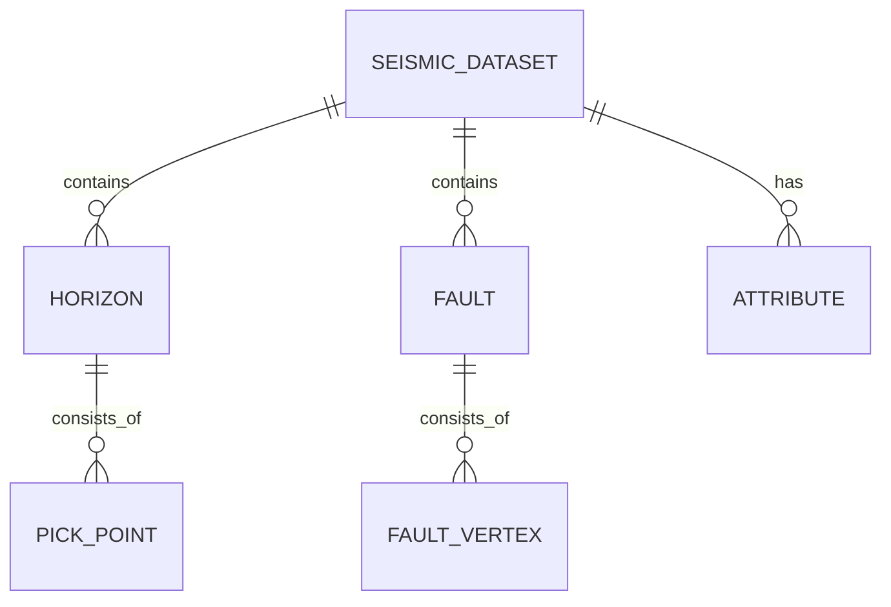

# 地震数据 Web 可视化解释系统 - 需求规格说明书

## 文档信息

| 项目 | 内容 |
|------|------|
| 项目名称 | Seismic Web Viewer（OpendTect Web 复刻版） |
| 文档版本 | v1.0 |
| 创建日期 | 2026-06-27 |
| 文档状态 | 需求规格基线 |
| 对标软件 | Schlumberger Petrel、IHS Kingdom、GeoEast、OpendTect |

---

## 1. 产品概述

### 1.1 产品定位

Seismic Web Viewer 是一款基于浏览器的专业地震数据可视化与解释平台，将传统桌面级地震解释软件（Petrel/Kingdom/GeoEast/OpendTect）的核心功能迁移到 Web 端，实现：

- **跨平台访问**：无需安装，通过浏览器即可使用
- **协作友好**：支持团队共享解释成果
- **数据安全**：敏感数据可本地部署
- **专业水准**：提供工业级地震解释功能

### 1.2 核心价值

| 价值维度 | 描述 |
|---------|------|
| 便捷性 | 零安装、零配置，打开浏览器即可使用 |
| 专业性 | 提供与桌面软件相当的显示和解释功能 |
| 性能 | 针对不同数据规模提供智能加载策略 |
| 扩展性 | 模块化架构，支持属性计算、AI 解释等插件扩展 |

### 1.3 目标用户

| 用户角色 | 典型场景 | 核心需求 |
|---------|---------|---------|
| 油气勘探工程师 | 井位论证、圈闭识别 | 快速浏览数据体、层位断层解释、属性分析 |
| 地球物理研究人员 | 地震方法研究 | 数据可视化、算法验证、属性提取 |
| 地质师 | 构造解释、沉积相分析 | 层位追踪、地层对比、时间构造图 |
| 高校师生 | 教学、课程设计 | 学习地震解释原理、实践操作 |

---

## 2. 功能需求规格

### 2.1 系统总体架构

```
┌─────────────────────────────────────────────────────────────────┐
│                        用户界面层                                 │
├─────────────────────────────────────────────────────────────────┤
│  菜单栏  │  工具栏  │           视图区域           │  右侧面板  │
│         │          ├──────────┬──────────┬─────────┤           │
│         │          │  Inline  │ Crossline│  Time   │           │
│  左侧面板│          │  剖面    │  剖面    │  Slice  │  属性/设置 │
│  数据树  │          ├──────────┴──────────┴─────────┤           │
│  层位列表│          │         3D 可视化视图         │           │
│  断层列表│          └───────────────────────────────┘           │
├─────────────────────────────────────────────────────────────────┤
│                        状态栏                                    │
└─────────────────────────────────────────────────────────────────┘
```

系统支持五种视图模式：
- **3D 视图**：三维数据体显示
- **Inline 单剖面**
- **Crossline 单剖面**
- **Time Slice 单切片**
- **四视图（Quad）**：三视图 + 3D 联动显示

---

### 2.2 模块 FR-01：数据管理

#### FR-01.1 数据集管理

| 需求ID | 需求描述 | 优先级 | 验收标准 |
|--------|---------|--------|---------|
| FR-01.1.1 | 支持加载内置模拟地震数据 | P0 | 系统启动时自动加载演示数据，立即可视化 |
| FR-01.1.2 | 支持 SEGY 文件导入 | P0 | 支持标准 SEGY Rev 0/Rev 1 格式文件上传 |
| FR-01.1.3 | 数据集列表展示 | P0 | 左侧面板数据树显示所有已导入数据集 |
| FR-01.1.4 | 数据集切换 | P0 | 点击数据集快速切换当前活动数据 |
| FR-01.1.5 | 数据集删除 | P1 | 支持删除不需要的数据集，释放内存 |
| FR-01.1.6 | 数据集元信息显示 | P1 | 显示 Inline/Crossline/Time 范围、采样间隔等 |

#### FR-01.2 SEGY 导入向导

| 需求ID | 需求描述 | 优先级 | 验收标准 |
|--------|---------|--------|---------|
| FR-01.2.1 | 文件拖拽/选择上传 | P0 | 支持点击选择和拖拽上传 SEGY 文件 |
| FR-01.2.2 | EBCDIC 文本头预览 | P0 | 显示前 3200 字节 EBCDIC 头，自动转换为 ASCII |
| FR-01.2.3 | 二进制头解析 | P0 | 自动解析采样间隔、采样点数、数据格式码 |
| FR-01.2.4 | 字节序自动检测 | P0 | 自动识别大端序（Motorola）/小端序（Intel），提供选择 |
| FR-01.2.5 | 道头字节位置自动检测 | P0 | 自动扫描候选字节位置（5/9/189/21...），推荐最优配置 |
| FR-01.2.6 | 手动配置字节位置 | P0 | 用户可手动指定 Inline/Crossline 道头字节位置 |
| FR-01.2.7 | 预设格式支持 | P1 | 内置标准 SEGY、G&G、ProMAX 等常见格式预设 |
| FR-01.2.8 | 数据预览 | P0 | 导入前显示预估参数：道数、Inline/Crossline 范围、时间范围 |
| FR-01.2.9 | 导入进度显示 | P0 | 实时显示导入进度百分比和当前阶段 |
| FR-01.2.10 | 参数安全校验 | P0 | 检测异常值（负数、超大值），防止内存溢出 |
| FR-01.2.11 | 数据格式支持 | P0 | IBM Float(1)、IEEE Float(5)、1/2/4 字节整数(2/3/4) |
| FR-01.2.12 | 扩展文本头处理 | P1 | 正确识别并跳过 N*3200 字节的扩展文本头 |

#### FR-01.3 数据加载策略

系统根据数据体大小自动选择最优加载策略：

| 策略 | 适用规模 | 核心技术 | 内存上限 |
|------|---------|---------|---------|
| **完整加载** | < 1 GB | 全量内存 + LRU 切片缓存 | 全量 |
| **分块加载** | 1-10 GB | 分块读取 + LRU 缓存 | 64 MB 默认 |
| **多分辨率金字塔** | 10-50 GB | 多分辨率层级 + 按需加载 | 动态 |
| **Zarr 云原生** | > 50 GB | 服务端分块压缩 + HTTP 流式 | 可配置缓存 |

---

### 2.3 模块 FR-02：3D 可视化

#### FR-02.1 三维数据体渲染

| 需求ID | 需求描述 | 优先级 | 验收标准 |
|--------|---------|--------|---------|
| FR-02.1.1 | 三个正交切片显示 | P0 | Inline/Crossline/Time 三个方向切片可同时显示 |
| FR-02.1.2 | 切片拖拽交互 | P0 | 鼠标直接在 3D 视图中拖动切片平面调整位置 |
| FR-02.1.3 | 数据体边框盒 | P0 | 显示半透明数据体外框，指示数据范围 |
| FR-02.1.4 | 坐标轴标签 | P0 | X=Inline(红)、Y=Time(绿)、Z=Crossline(蓝) 三轴标签和箭头 |
| FR-02.1.5 | 切片边框高亮 | P1 | 当前激活切片边缘高亮显示 |
| FR-02.1.6 | 网格显示 | P2 | 可选显示数据体网格线 |
| FR-02.1.7 | 透明度调节 | P0 | 切片透明度 0-100% 可调 |

#### FR-02.2 相机与视角控制

| 需求ID | 需求描述 | 优先级 | 验收标准 |
|--------|---------|--------|---------|
| FR-02.2.1 | 轨道控制（Orbit Controls） | P0 | 左键旋转、右键平移、滚轮缩放 |
| FR-02.2.2 | 视角预设 | P1 | 透视/前视/顶视/侧视/等轴测 快速切换 |
| FR-02.2.3 | 视角重置 | P1 | 一键回到默认视角 |
| FR-02.2.4 | 正交/透视切换 | P2 | 支持正交投影和透视投影切换 |

#### FR-02.3 层位/断层 3D 显示

| 需求ID | 需求描述 | 优先级 | 验收标准 |
|--------|---------|--------|---------|
| FR-02.3.1 | 层位点云显示 | P1 | 3D 视图中显示拾取的层位点 |
| FR-02.3.2 | 断层线显示 | P1 | 3D 视图中显示断层解释线 |
| FR-02.3.3 | 层位曲面插值 | P2 | 将拾取点插值为曲面显示（未来） |

---

### 2.4 模块 FR-03：2D 剖面显示

#### FR-03.1 基础显示功能

| 需求ID | 需求描述 | 优先级 | 验收标准 |
|--------|---------|--------|---------|
| FR-03.1.1 | Inline 剖面显示 | P0 | 垂直剖面，X 轴为 Crossline，Y 轴为 Time |
| FR-03.1.2 | Crossline 剖面显示 | P0 | 垂直剖面，X 轴为 Inline，Y 轴为 Time |
| FR-03.1.3 | Time Slice 显示 | P0 | 水平切片，X 轴为 Inline，Y 轴为 Crossline |
| FR-03.1.4 | 剖面标题显示 | P0 | 显示剖面类型和实际测线号/时间值 |
| FR-03.1.5 | 坐标轴刻度标注 | P0 | X/Y 轴显示实际道号/时间值刻度 |
| FR-03.1.6 | 色标（Colorbar） | P0 | 右侧显示垂直色标，标注数据值范围 |
| FR-03.1.7 | 数据值实时读取 | P0 | 鼠标移动时状态栏实时显示坐标和振幅值 |
| FR-03.1.8 | 变密度显示（VD） | P0 | 彩色像素方式显示地震振幅 |

#### FR-03.2 专业显示模式（对标 Petrel/Kingdom）

| 需求ID | 需求描述 | 优先级 | 验收标准 |
|--------|---------|--------|---------|
| FR-03.2.1 | 波形显示（Wiggle） | P0 | 地震波形曲线，正值红色/负值蓝色 |
| FR-03.2.2 | 变面积显示（VA） | P0 | 波形 + 正/负面积填充 |
| FR-03.2.3 | 波形+变面积 | P0 | 波形曲线叠加在变密度背景上（50% 透明度） |
| FR-03.2.4 | 波形极性选择 | P0 | 正极性/负极性/双向 三种显示极性 |
| FR-03.2.5 | 波形重叠度调节 | P1 | 控制波形横向重叠程度 0-100% |
| FR-03.2.6 | 道间隔显示 | P2 | 显示道间隔参考线 |

#### FR-03.3 增益与振幅控制

| 需求ID | 需求描述 | 优先级 | 验收标准 |
|--------|---------|--------|---------|
| FR-03.3.1 | 全局增益 | P0 | 增益倍数 0.1x - 10x 连续可调 |
| FR-03.3.2 | AGC 自动增益控制 | P0 | 时窗大小 0-200ms 可调，0 为关闭 |
| FR-03.3.3 | 一键重置增益 | P0 | 快速恢复 Gain=1, AGC=Off |
| FR-03.3.4 | 亮度调节 | P0 | -1 到 +1 连续可调 |
| FR-03.3.5 | 对比度调节 | P0 | -1 到 +1 连续可调 |

#### FR-03.4 剖面导航

| 需求ID | 需求描述 | 优先级 | 验收标准 |
|--------|---------|--------|---------|
| FR-03.4.1 | 鼠标滚轮翻页 | P0 | 滚轮上下滚动切换相邻切片 |
| FR-03.4.2 | ±1/±10 快捷按钮 | P0 | 单步/大步前进后退按钮 |
| FR-03.4.3 | 切片索引显示 | P0 | 显示当前切片序号/总切片数 |
| FR-03.4.4 | 道号快速跳转 | P0 | 按 G 键弹出输入框，输入道号快速跳转 |
| FR-03.4.5 | 滑块精确控制 | P1 | 右侧面板滑块拖动选择切片位置 |
| FR-03.4.6 | 切片动画播放 | P2 | 自动播放切片序列，速度可调 |

#### FR-03.5 缩放与平移

| 需求ID | 需求描述 | 优先级 | 验收标准 |
|--------|---------|--------|---------|
| FR-03.5.1 | Ctrl+滚轮缩放 | P0 | 按住 Ctrl 滚轮缩放剖面 |
| FR-03.5.2 | 中键拖拽平移 | P0 | 鼠标中键/平移工具拖拽平移视图 |
| FR-03.5.3 | +/-/0 快捷键 | P0 | 放大、缩小、重置视图快捷键 |
| FR-03.5.4 | 缩放比例显示 | P1 | 显示当前缩放百分比 |
| FR-03.5.5 | 缩放限制 | P1 | 最小 0.5x，最大 16x |

#### FR-03.6 多视图联动

| 需求ID | 需求描述 | 优先级 | 验收标准 |
|--------|---------|--------|---------|
| FR-03.6.1 | 切片位置联动 | P0 | 一个视图中移动切片，其他视图同步更新 |
| FR-03.6.2 | 十字准线联动 | P0 | 四个视图十字准线位置同步（可开关） |
| FR-03.6.3 | 点击定位 | P0 | 在任意剖面点击，其他剖面自动跳转到对应位置 |
| FR-03.6.4 | 十字准线样式 | P1 | 青色虚线十字，中心圆点 |

---

### 2.5 模块 FR-04：地震解释工具

#### FR-04.1 层位解释（Horizon Interpretation）

| 需求ID | 需求描述 | 优先级 | 验收标准 |
|--------|---------|--------|---------|
| FR-04.1.1 | 层位创建 | P0 | 新建层位，自定义名称和颜色 |
| FR-04.1.2 | 手动拾取 | P0 | 逐点点击拾取层位点 |
| FR-04.1.3 | 波峰自动拾取 | P0 | 点击后自动搜索局部波峰位置拾取 |
| FR-04.1.4 | 波谷自动拾取 | P0 | 点击后自动搜索局部波谷位置拾取 |
| FR-04.1.5 | 零交叉点拾取 | P1 | 自动搜索零值交叉点 |
| FR-04.1.6 | 拾取点实时显示 | P0 | 剖面上实时绘制已拾取的层位线 |
| FR-04.1.7 | 完成拾取 | P0 | 双击/Enter 键完成当前层位拾取 |
| FR-04.1.8 | 取消拾取 | P0 | 右键/Esc 键取消拾取，清除未保存点 |
| FR-04.1.9 | 撤销拾取点 | P0 | Backspace/Delete 删除最后一个拾取点 |
| FR-04.1.10 | 层位显示/隐藏 | P0 | 左侧面板控制层位可见性 |
| FR-04.1.11 | 层位颜色设置 | P1 | 支持自定义层位显示颜色 |
| FR-04.1.12 | 层位删除 | P0 | 删除不需要的层位 |
| FR-04.1.13 | 活动层位高亮 | P0 | 当前拾取层位高亮显示 |
| FR-04.1.14 | 层位名称编辑 | P2 | 双击重命名层位 |
| FR-04.1.15 | 自动追踪（Auto-track） | P2 | 基于波形相似性自动追踪层位（未来） |

#### FR-04.2 断层解释（Fault Interpretation）

| 需求ID | 需求描述 | 优先级 | 验收标准 |
|--------|---------|--------|---------|
| FR-04.2.1 | 断层创建 | P0 | 新建断层，自定义名称和颜色 |
| FR-04.2.2 | 断层线绘制 | P0 | 在剖面上逐点绘制断层线 |
| FR-04.2.3 | 断层线样式 | P0 | 虚线显示，默认红色系 |
| FR-04.2.4 | 断距设置 | P2 | 设置断层垂直断距 |
| FR-04.2.5 | 断层显示/隐藏 | P0 | 左侧面板控制断层可见性 |
| FR-04.2.6 | 断层删除 | P0 | 删除断层 |
| FR-04.2.7 | 断层组合 | P2 | 多剖面断层线组合为断层面（未来） |

#### FR-04.3 测量工具

| 需求ID | 需求描述 | 优先级 | 验收标准 |
|--------|---------|--------|---------|
| FR-04.3.1 | 距离测量 | P0 | 在剖面上点击两点/多点测量距离 |
| FR-04.3.2 | 时间差测量 | P0 | 时间剖面上显示时间差（ms） |
| FR-04.3.3 | 平面距离测量 | P0 | Time Slice 上显示平面距离（m） |
| FR-04.3.4 | 累计距离 | P1 | 多点折线累计距离 |
| FR-04.3.5 | 测量点清除 | P0 | Esc/右键清除所有测量点 |
| FR-04.3.6 | 测量点撤销 | P1 | Backspace 删除最后一个测量点 |
| FR-04.3.7 | 测量线样式 | P1 | 青色虚线，端点圆点 |

---

### 2.6 模块 FR-05：色带与显示设置

#### FR-05.1 色带（Colormap）

| 需求ID | 需求描述 | 优先级 | 验收标准 |
|--------|---------|--------|---------|
| FR-05.1.1 | Seismic（蓝-白-红） | P0 | 标准地震振幅显示色带 |
| FR-05.1.2 | 红-白-蓝（反转） | P0 | 反转地震色带，正值蓝色 |
| FR-05.1.3 | 黑-红（Black-Red） | P0 | GeoEast 常用黑红黄色带 |
| FR-05.1.4 | 灰度（Gray） | P0 | 黑白灰度显示 |
| FR-05.1.5 | 彩虹（Rainbow） | P1 | 紫蓝青绿黄红多色带 |
| FR-05.1.6 | 热色（Hot） | P1 | 黑红黄色带 |
| FR-05.1.7 | 冷色（Cool） | P1 | 青品红色带 |
| FR-05.1.8 | Viridis | P2 | 感知均匀科学色带 |
| FR-05.1.9 | Plasma | P2 | 感知均匀科学色带 |
| FR-05.1.10 | 色带预览 | P0 | 右侧面板色带列表显示渐变预览 |
| FR-05.1.11 | 色带切换实时生效 | P0 | 点击色带立即更新所有视图 |

#### FR-05.2 色标（Colorbar）

| 需求ID | 需求描述 | 优先级 | 验收标准 |
|--------|---------|--------|---------|
| FR-05.2.1 | 垂直色标显示 | P0 | 2D 剖面右侧显示色标 |
| FR-05.2.2 | 最大值/最小值标注 | P0 | 色标顶部显示最大值，底部显示最小值 |
| FR-05.2.3 | 增益联动更新 | P0 | 增益变化时色标标注同步更新 |

---

### 2.7 模块 FR-06：属性分析

| 需求ID | 需求描述 | 优先级 | 验收标准 |
|--------|---------|--------|---------|
| FR-06.1 | 振幅属性提取 | P1 | 沿层振幅提取、最大振幅、最小振幅、平均振幅 |
| FR-06.2 | 相干体计算 | P2 | 基于相似性的相干体算法（C1/C2/C3） |
| FR-06.3 | 曲率属性 | P2 | 最大曲率、最小曲率、高斯曲率、平均曲率 |
| FR-06.4 | 瞬时属性 | P2 | 瞬时相位、瞬时频率、瞬时振幅 |
| FR-06.5 | 属性体显示 | P2 | 属性体作为新数据集加载显示 |
| FR-06.6 | 属性剖面显示 | P2 | 在剖面上叠加显示属性 |

---

### 2.8 模块 FR-07：用户界面

#### FR-07.1 布局组件

| 需求ID | 需求描述 | 优先级 | 验收标准 |
|--------|---------|--------|---------|
| FR-07.1.1 | 菜单栏 | P0 | File/Edit/View/Tools/Help 标准菜单 |
| FR-07.1.2 | 工具栏 | P0 | 常用工具快捷按钮 |
| FR-07.1.3 | 左侧面板 | P0 | 数据/层位/断层三标签页，可折叠 |
| FR-07.1.4 | 右侧面板 | P0 | 显示/色带/属性/设置四标签页，可折叠 |
| FR-07.1.5 | 中央视图区 | P0 | 单视图/四视图切换 |
| FR-07.1.6 | 状态栏 | P0 | 显示坐标、振幅值、进度等信息 |
| FR-07.1.7 | 面板折叠 | P0 | Q/W 键快速折叠/展开左右面板 |

#### FR-07.2 工具栏工具

| 工具 | 图标 | 快捷键 | 功能 |
|------|------|--------|------|
| 选择 | V | V | 选择/查看模式 |
| 层位拾取 | T | T | 层位解释工具 |
| 断层拾取 | Y | Y | 断层解释工具 |
| 测量 | M | M | 距离测量工具 |
| 缩放 | Z | Z | 框选放大 |
| 平移 | H | H | 视图平移 |
| 旋转 | R | R | 3D 视图旋转 |
| SEGY 导入 | - | - | 打开导入向导 |

#### FR-07.3 状态栏信息

| 区域 | 显示内容 | 更新频率 |
|------|---------|---------|
| 左侧 | 当前工具提示 | 工具切换时 |
| 中部 | Inline/Crossline/Time 坐标 | 鼠标移动实时 |
| 中部 | 振幅值（4 位小数） | 鼠标移动实时 |
| 右侧 | 加载进度/内存状态 | 事件触发 |
| 右侧 | 视图缩放比例 | 缩放时更新 |

#### FR-07.4 加载与错误提示

| 需求ID | 需求描述 | 优先级 | 验收标准 |
|--------|---------|--------|---------|
| FR-07.4.1 | 全局加载遮罩 | P0 | 数据加载时显示 Loading 覆盖层 |
| FR-07.4.2 | 加载进度条 | P0 | 显示加载百分比和阶段文字 |
| FR-07.4.3 | 错误提示 | P0 | 友好的错误信息提示 |
| FR-07.4.4 | WebGL 不可用提示 | P0 | 检测到 WebGL 不可用时显示提示 |
| FR-07.4.5 | 空数据提示 | P0 | 无数据集时显示引导提示 |

---

### 2.9 模块 FR-08：快捷键系统

#### FR-08.1 视图切换

| 快捷键 | 功能 |
|--------|------|
| `1` | 切换到 3D 视图 |
| `2` | 切换到 Inline 剖面 |
| `3` | 切换到 Crossline 剖面 |
| `4` | 切换到 Time Slice |
| `5` | 切换到四视图 |

#### FR-08.2 工具切换

| 快捷键 | 功能 |
|--------|------|
| `V` | 选择工具 |
| `T` | 层位拾取工具 |
| `Y` | 断层拾取工具 |
| `M` | 测量工具 |
| `Z` | 缩放工具 |
| `H` | 平移工具 |
| `R` | 旋转工具 |

#### FR-08.3 视图操作

| 快捷键 | 功能 |
|--------|------|
| `+` / `=` | 放大剖面 |
| `-` | 缩小剖面 |
| `0` | 重置视图缩放 |
| `Q` | 折叠/展开左侧面板 |
| `W` | 折叠/展开右侧面板 |
| `G` | 道号快速跳转 |

#### FR-08.4 解释操作

| 快捷键 | 功能 |
|--------|------|
| `Enter` / 双击 | 完成层位/断层拾取 |
| `Esc` / 右键 | 取消拾取/清除测量 |
| `Backspace` / `Delete` | 撤销最后拾取点/测量点 |
| `?` / `/` | 显示快捷键帮助 |

---

### 2.10 模块 FR-09：性能优化

| 需求ID | 需求描述 | 优先级 | 验收标准 |
|--------|---------|--------|---------|
| FR-09.1 | LRU 切片缓存 | P0 | 64MB 切片缓存，重复访问切片直接返回 |
| FR-09.2 | 波形降采样绘制 | P0 | 缩小时自动抽稀道数绘制，保证性能 |
| FR-09.3 | ImageData 批量渲染 | P0 | 变密度模式使用 ImageData 一次性绘制 |
| FR-09.4 | 纹理切片法 3D 渲染 | P0 | 3D 切片使用 GPU 纹理渲染 |
| FR-09.5 | 内存安全限制 | P0 | 数据体最大 256M 样本，单切片最大 64M 样本 |
| FR-09.6 | 渲染帧率目标 | P1 | 交互操作时帧率 ≥ 30fps，静止时 ≥ 60fps |

---

## 3. 非功能需求

### 3.1 性能需求

| 指标 | 要求 |
|------|------|
| 首屏加载时间 | < 3 秒（开发模式），< 2 秒（生产构建） |
| 切片切换响应时间 | < 100ms（缓存命中），< 500ms（缓存未命中） |
| 2D 剖面缩放平移 | 实时响应，无明显卡顿 |
| 3D 视图旋转帧率 | ≥ 30 fps |
| SEGY 导入速度 | ≥ 50 MB/s（解析速度） |
| 内存占用（<1GB 数据） | ≤ 数据量 × 4 字节 + 200MB 运行时 |

### 3.2 兼容性需求

| 类别 | 要求 |
|------|------|
| 浏览器 | Chrome 90+、Firefox 90+、Edge 90+、Safari 15+ |
| WebGL | 支持 WebGL 2.0，不支持时显示降级提示 |
| 分辨率 | 最低支持 1280×800，推荐 1920×1080 及以上 |
| 操作系统 | Windows 10+、macOS 11+、Linux（主流发行版） |
| 移动端 | 暂不支持触屏优化，桌面端优先 |

### 3.3 可用性需求

| 需求 | 描述 |
|------|------|
| 深色主题 | 默认深色工业风主题，保护视力，适合长时间工作 |
| 专业术语 | 使用石油行业标准术语（Inline/Crossline/Time/CDP 等） |
| 操作一致性 | 与 Petrel/Kingdom/OpendTect 操作习惯保持一致 |
| 撤销/重做 | 解释操作支持撤销/重做 |
| 错误恢复 | 导入失败、数据异常时不崩溃，给出明确提示 |

### 3.4 可靠性需求

| 需求 | 描述 |
|------|------|
| 数据校验 | SEGY 导入时多层安全校验，防止异常数据导致崩溃 |
| 内存保护 | 数组分配前安全检查，防止溢出 |
| 错误边界 | React Error Boundary 捕获渲染错误 |
| 状态一致性 | 多视图状态保持同步，无错位 |

### 3.5 可扩展性需求

| 需求 | 描述 |
|------|------|
| 模块化 | 各功能模块松耦合，便于独立开发测试 |
| 数据提供者抽象 | BaseDataProvider 接口统一，新数据源实现接口即可接入 |
| 属性插件化 | 属性计算采用注册机制，便于添加新属性算法 |
| 后端服务独立 | 前后端分离，可独立部署和扩展 |

---

## 4. 技术架构规格

### 4.1 技术栈选型

| 层级 | 技术选型 | 版本要求 | 选型理由 |
|------|---------|---------|---------|
| 前端框架 | React | 18.x | 生态成熟，社区活跃 |
| 类型系统 | TypeScript | 5.x | 类型安全，减少运行时错误 |
| 构建工具 | Vite | 6.x | 开发体验好，HMR 快速 |
| 样式方案 | TailwindCSS | 3.x | 原子化 CSS，开发效率高 |
| 状态管理 | Zustand | 5.x | 轻量、简单、TypeScript 友好 |
| 3D 渲染 | Three.js | 0.160.x | Web 端最成熟的 3D 库 |
| React Three Fiber | @react-three/fiber | 8.x | React 声明式 Three.js 绑定 |
| 3D 辅助组件 | @react-three/drei | 9.x | 常用 3D 辅助组件（OrbitControls、Html 等） |
| 图标库 | Lucide React | 0.511.x | 线性图标，风格统一 |
| 后端框架 | Express | 4.x | Node.js 生态最成熟的 Web 框架 |
| 文件上传 | Multer | 1.x | 处理 multipart/form-data 上传 |
| 运行时 | tsx | 4.x | TypeScript 直接执行，无需编译 |

### 4.2 目录结构规格

```
/workspace
├── api/                          # 后端服务（Express + TypeScript）
│   ├── routes/                   # API 路由
│   │   ├── seismic.ts            # 地震数据访问
│   │   ├── segy.ts               # SEGY 上传/导入
│   │   ├── attributes.ts         # 属性计算
│   │   ├── zarr.ts               # Zarr 数据服务
│   │   └── auth.ts               # 认证（预留）
│   ├── utils/                    # 后端工具
│   │   ├── segyToZarr.ts         # SEGY→Zarr 转换器
│   │   └── zarr.ts               # Zarr 读写
│   ├── app.ts                    # Express 应用配置
│   ├── server.ts                 # 服务启动入口
│   └── index.ts                  # 应用入口
├── shared/                       # 前后端共享类型
│   └── types.ts                  # 所有核心类型定义
├── src/                          # 前端应用（React + TypeScript）
│   ├── components/
│   │   ├── layout/               # 布局组件
│   │   │   ├── MenuBar.tsx
│   │   │   ├── ToolBar.tsx
│   │   │   ├── LeftPanel.tsx
│   │   │   ├── RightPanel.tsx
│   │   │   └── StatusBar.tsx
│   │   ├── viewer/               # 视图组件
│   │   │   ├── Viewer3D.tsx      # 3D 视图
│   │   │   └── SliceView.tsx     # 2D 剖面通用组件
│   │   └── common/               # 通用组件
│   │       ├── Modal.tsx
│   │       ├── LoadingOverlay.tsx
│   │       ├── SegyImportModal.tsx
│   │       └── KeyboardShortcutsModal.tsx
│   ├── data/
│   │   ├── providers/            # 数据提供者（策略模式）
│   │   │   ├── BaseDataProvider.ts
│   │   │   ├── FullVolumeDataProvider.ts
│   │   │   ├── ChunkedDataProvider.ts
│   │   │   ├── PyramidDataProvider.ts
│   │   │   ├── ZarrDataProvider.ts
│   │   │   └── dataProviderFactory.ts
│   │   └── mockSeismic.ts        # 模拟演示数据
│   ├── store/                    # Zustand 状态管理
│   │   ├── seismicStore.ts       # 地震数据状态
│   │   ├── viewerStore.ts        # 视图状态
│   │   ├── interpretationStore.ts # 解释状态
│   │   └── themeStore.ts         # 主题状态
│   ├── utils/
│   │   ├── colormap.ts           # 色带映射
│   │   ├── lruCache.ts           # LRU 缓存
│   │   ├── resample.ts           # 重采样
│   │   ├── segyUtils.ts          # SEGY 解析工具
│   │   ├── dataStrategy.ts       # 数据策略推荐
│   │   └── zarrClient.ts         # Zarr HTTP 客户端
│   ├── hooks/                    # 自定义 Hooks
│   ├── pages/
│   │   ├── Home.tsx
│   │   └── Workbench.tsx         # 主工作台
│   ├── lib/
│   │   └── utils.ts              # 通用工具（cn）
│   ├── App.tsx
│   ├── main.tsx
│   └── index.css
├── uploads/                      # SEGY 上传存储目录
├── scripts/
│   └── generate_test_segy.js     # 测试数据生成脚本
├── .trae/documents/              # 项目文档
│   ├── PRD.md
│   ├── TECHNICAL_ARCHITECTURE.md
│   └── SPEC.md                   # 本文档
├── package.json
├── vite.config.ts
├── tailwind.config.js
└── tsconfig.json
```

### 4.3 状态管理规格

使用 Zustand 按领域划分四个独立 Store：

#### 4.3.1 seismicStore（地震数据状态）

```typescript
interface SeismicState {
  datasets: SeismicDataset[];
  activeDatasetId: string | null;
  dataProvider: DataProvider | null;
  isLoading: boolean;
  loadProgress: DataLoadProgress | null;
  error: string | null;
  
  // Actions
  loadMockDataset: () => Promise<void>;
  importSegy: (file: File, options: SegyImportOptions) => Promise<void>;
  setActiveDataset: (id: string) => Promise<void>;
  removeDataset: (id: string) => void;
  getSlice: (type: SliceType, index: number) => SeismicSliceData;
  getValue: (inline: number, crossline: number, time: number) => number;
}
```

#### 4.3.2 viewerStore（视图状态）

```typescript
interface ViewerState {
  viewMode: ViewerMode;
  inlineIndex: number;
  crosslineIndex: number;
  timeIndex: number;
  colormap: ColormapType;
  displayMode: DisplayMode;
  opacity: number;
  brightness: number;
  contrast: number;
  gain: number;
  agcWindow: number;
  wiggleOverlap: number;
  wigglePolarity: WigglePolarity;
  pickMode: PickMode;
  showCrosshair: boolean;
  crosshairPosition: Point3D | null;
  cursorPosition: CursorPosition | null;
  sliceVisibility: SliceVisibility;
  cameraPreset: CameraPreset;
  
  // Actions
  setViewMode: (mode: ViewerMode) => void;
  setInlineIndex: (i: number) => void;
  setCrosslineIndex: (i: number) => void;
  setTimeIndex: (i: number) => void;
  setColormap: (c: ColormapType) => void;
  setDisplayMode: (m: DisplayMode) => void;
  setGain: (g: number) => void;
  setAgcWindow: (w: number) => void;
  setPickMode: (m: PickMode) => void;
  setSliceIndices: (i: {inline?, crossline?, time?}) => void;
  jumpToPosition: (inline, crossline, time) => void;
}
```

#### 4.3.3 interpretationStore（解释状态）

```typescript
interface InterpretationState {
  activeTool: ToolType;
  horizons: Horizon[];
  faults: Fault[];
  activeHorizonId: string | null;
  activeFaultId: string | null;
  isPicking: boolean;
  currentPickPoints: Point3D[];
  undoStack: HistoryEntry[];
  redoStack: HistoryEntry[];
  
  // Actions
  setActiveTool: (tool: ToolType) => void;
  addHorizon: (name: string) => void;
  addFault: (name: string) => void;
  startPicking: () => void;
  addPickPoint: (point: Point3D) => void;
  removeLastPickPoint: () => void;
  finishPicking: () => void;
  cancelPicking: () => void;
  toggleHorizonVisible: (id: string) => void;
  toggleFaultVisible: (id: string) => void;
  deleteHorizon: (id: string) => void;
  deleteFault: (id: string) => void;
  undo: () => void;
  redo: () => void;
}
```

### 4.4 数据提供者模式（策略模式）

```typescript
abstract class BaseDataProvider {
  abstract dataset: SeismicDataset;
  abstract isLoaded: boolean;
  
  abstract load(options?: DataLoadOptions): Promise<void>;
  abstract unload(): void;
  abstract getSlice(type: SliceType, index: number): SeismicSliceData;
  abstract getValue(inline: number, crossline: number, time: number): number;
  abstract getStats(): DataStats;
  
  onProgress(callback: (progress: DataLoadProgress) => void): () => void;
}
```

**工厂函数**根据数据大小自动选择策略：
- 数据体 < 1GB → FullVolumeDataProvider
- 数据体 1-10GB → ChunkedDataProvider
- 数据体 > 10GB → PyramidDataProvider 或 ZarrDataProvider

---

## 5. 数据模型规格

### 5.1 核心实体关系



### 5.2 实体字段定义

#### SeismicDataset（地震数据集）

| 字段 | 类型 | 说明 |
|------|------|------|
| id | string | 唯一标识 |
| name | string | 数据集名称 |
| inlineCount | number | Inline 道数 |
| crosslineCount | number | Crossline 道数 |
| timeSamples | number | 时间采样点数 |
| sampleInterval | number | 采样间隔（ms） |
| inlineStart | number | 起始 Inline 号 |
| crosslineStart | number | 起始 Crossline 号 |
| timeStart | number | 起始时间（ms） |
| inlineStep | number | Inline 步长（通常为 1） |
| crosslineStep | number | Crossline 步长（通常为 1） |
| source | 'mock' \| 'segy' \| 'api' | 数据来源 |
| minValue | number | 最小振幅值 |
| maxValue | number | 最大振幅值 |
| createdAt | Date | 创建时间 |

#### Horizon（层位）

| 字段 | 类型 | 说明 |
|------|------|------|
| id | string | 唯一标识 |
| name | string | 层位名称（如 T1、T2） |
| datasetId | string | 所属数据集 ID |
| color | string | 显示颜色（十六进制） |
| points | Point3D[] | 拾取点数组 |
| visible | boolean | 是否可见 |
| createdAt | Date | 创建时间 |

#### Fault（断层）

| 字段 | 类型 | 说明 |
|------|------|------|
| id | string | 唯一标识 |
| name | string | 断层名称（如 F1、F2） |
| datasetId | string | 所属数据集 ID |
| color | string | 显示颜色 |
| vertices | Point3D[] | 断层顶点数组 |
| throw | number | 断距 |
| visible | boolean | 是否可见 |
| createdAt | Date | 创建时间 |

#### Point3D（三维坐标点）

| 字段 | 类型 | 说明 |
|------|------|------|
| x | number | Inline 方向坐标（实际 Inline 号） |
| y | number | Crossline 方向坐标（实际 Crossline 号） |
| z | number | Time 方向坐标（实际时间值 ms） |

---

## 6. API 接口规格

### 6.1 接口基础信息

| 项 | 值 |
|----|----|
| 基础路径 | `/api` |
| 后端端口 | 3001（开发），生产通过反向代理 |
| 数据格式 | JSON / 二进制（Float32Array） |
| 字符编码 | UTF-8 |

Vite 开发代理配置：
```typescript
proxy: {
  '/api': {
    target: 'http://localhost:3001',
    changeOrigin: true,
  }
}
```

### 6.2 健康检查

```http
GET /api/health
```

**Response 200:**
```json
{
  "status": "ok",
  "timestamp": "2026-06-27T...",
  "version": "1.0.0"
}
```

### 6.3 SEGY 导入接口

```http
POST /api/segy/import
Content-Type: multipart/form-data
```

**Request Body:**

| 字段 | 类型 | 必填 | 说明 |
|------|------|------|------|
| file | File | 是 | SEGY 文件 |
| datasetName | string | 是 | 数据集名称 |
| inlineByte | number | 否 | Inline 道头字节位置（默认 189） |
| crosslineByte | number | 否 | Crossline 道头字节位置（默认 193） |
| byteOrder | string | 否 | 'auto' \| 'big-endian' \| 'little-endian'（默认 auto） |
| dataFormatCode | number | 否 | 数据格式码（自动检测时不传） |

**Response 200:**
```json
{
  "success": true,
  "datasetId": "segy-1782236413790",
  "dataset": {
    "id": "segy-1782236413790",
    "name": "test_data.segy",
    "inlineCount": 101,
    "crosslineCount": 121,
    "timeSamples": 800,
    "sampleInterval": 4,
    "inlineStart": 2720,
    "crosslineStart": 1920,
    "timeStart": 5000,
    "inlineStep": 1,
    "crosslineStep": 1,
    "source": "segy",
    "minValue": -32767,
    "maxValue": 32767
  }
}
```

**Response 500:**
```json
{
  "success": false,
  "error": "错误信息描述"
}
```

### 6.4 SEGY 预览接口

```http
POST /api/segy/preview
Content-Type: multipart/form-data
```

读取文件头部信息，返回预估参数供用户确认。

**Response 200:**
```json
{
  "success": true,
  "ebcdicHeader": "C 1 SEGY OUTPUT FROM...",
  "binaryHeader": {
    "sampleInterval": 4,
    "samplesPerTrace": 800,
    "dataFormatCode": 1,
    "numExtendedHeaders": 0
  },
  "preview": {
    "estimatedTraces": 12221,
    "inlineRange": [2720, 2820],
    "crosslineRange": [1920, 2120],
    "timeRange": [5000, 8200],
    "detectedByteOrder": "big-endian",
    "recommendedInlineByte": 9,
    "recommendedCrosslineByte": 21
  }
}
```

### 6.5 数据集列表接口

```http
GET /api/segy/datasets
```

**Response 200:**
```json
{
  "datasets": [
    {
      "id": "segy-xxx",
      "name": "xxx.segy",
      "inlineCount": 101,
      "crosslineCount": 121,
      "timeSamples": 800,
      "sampleInterval": 4,
      "source": "segy",
      "createdAt": "2026-06-27T..."
    }
  ]
}
```

### 6.6 完整数据体接口

```http
GET /api/segy/datasets/:id/volume
```

返回完整数据体，二进制 Float32Array 格式（小端序）。

**Response:**
- Content-Type: application/octet-stream
- Body: raw Float32Array binary data
- X-Header 附加元信息（inlineCount, crosslineCount, timeSamples, minValue, maxValue）

### 6.7 切片数据接口

```http
GET /api/segy/datasets/:id/slice?type=inline&index=50
```

**Query Parameters:**

| 参数 | 类型 | 必填 | 说明 |
|------|------|------|------|
| type | string | 是 | 'inline' \| 'crossline' \| 'timeslice' |
| index | number | 是 | 切片索引（从 0 开始） |

**Response:**
- Content-Type: application/octet-stream
- Body: raw Float32Array binary data
- X-Header: width, height, minValue, maxValue

### 6.8 属性计算接口（开发中）

```http
POST /api/attributes/compute
Content-Type: application/json
```

**Request Body:**
```json
{
  "datasetId": "segy-xxx",
  "attributeType": "coherence",
  "parameters": {
    "windowInline": 3,
    "windowCrossline": 3,
    "windowTime": 9
  }
}
```

**Response 202:**
```json
{
  "success": true,
  "jobId": "attr-xxx",
  "status": "processing"
}
```

---

## 7. UI/UX 设计规格

### 7.1 设计风格

| 设计项 | 规格 |
|--------|------|
| 主题 | 深色工业风，专业地球物理软件风格 |
| 背景色 | #0a0f1a（主背景）、#0f172a（面板）、#1e293b（悬停） |
| 主色调 | 蓝色系 #3b82f6（选中/激活/强调） |
| 辅助色 | 青色 #22d3ee（十字准线/测量）、琥珀色 #f59e0b（警告/拾取） |
| 层位色 | 暖色系：橙、黄、粉、紫 |
| 断层色 | 红色系：红、玫红 |
| 字体 | 系统无衬线（UI）+ monospace（数值/坐标） |
| 字号 | 标题 11-12px，正文 10-11px，辅助文字 9px |
| 图标 | Lucide React 线性图标，尺寸 14-16px |
| 圆角 | 按钮/面板 2-4px 小圆角，硬朗专业 |
| 边框 | 1px 细边框，颜色 #334155 |

### 7.2 布局规格

```
┌─────────────────────────────────────────────────────────────────┐
│  MenuBar (32px)                                                  │
├────────┬───────────────────────────────────────────────┬────────┤
│        │  ToolBar (36px)                                │        │
│        ├────────────┬────────────┬─────────────────────┤        │
│        │            │            │                     │        │
│ Left   │  Inline    │ Crossline  │    Time Slice       │ Right  │
│ Panel  │  View      │  View      │    View             │ Panel  │
│ (240px)│            │            │                     │ (256px)│
│        ├────────────┴────────────┴─────────────────────┤        │
│        │                                               │        │
│        │              3D View                          │        │
│        │                                               │        │
├────────┴───────────────────────────────────────────────┴────────┤
│  StatusBar (24px)                                               │
└─────────────────────────────────────────────────────────────────┘
```

### 7.3 色带标准

| 色带名称 | 渐变定义 | 使用场景 |
|---------|---------|---------|
| Seismic | 蓝→浅蓝→白→浅红→红 | 标准振幅显示（默认） |
| Red-White-Blue | 红→浅红→白→浅蓝→蓝 | 反极性振幅显示 |
| Black-Red | 黑→暗红→红→橙→黄→白 | GeoEast 风格强振幅显示 |
| Gray | 黑→白 | 构造显示、底图 |
| Rainbow | 紫→蓝→青→绿→黄→红 | 切片、属性显示 |

### 7.4 交互反馈

| 交互 | 反馈方式 |
|------|---------|
| 按钮悬停 | 背景色变浅 10%，cursor: pointer |
| 按钮激活 | 主色调背景，白色文字 |
| 工具选中 | 蓝色背景高亮，左侧蓝色竖条 |
| 加载中 | 旋转 Spinner + 文字提示 |
| 滑块拖动 | 数值实时更新显示 |
| 拾取点 | 圆形节点 + 白色描边 |
| 十字准线 | 青色虚线 + 中心圆点 |

---

## 8. SEGY 格式支持规格

### 8.1 支持的 SEGY 版本

- SEGY Rev 0（1975 年标准）
- SEGY Rev 1（2002 年标准）
- 部分 SEGY Rev 2 扩展特性

### 8.2 文件结构处理

| 部分 | 大小 | 处理方式 |
|------|------|---------|
| EBCDIC 文本头 | 3200 字节 | 自动 EBCDIC→ASCII 转换，支持显示 |
| 二进制头 | 400 字节 | 解析关键字段（采样间隔、采样点数、格式码等） |
| 扩展文本头 | N × 3200 字节 | 自动识别并跳过 |
| 道数据 | 道头(240字节) + 采样数据 | 逐道解析，提取道头信息和数据 |

### 8.3 二进制头关键字段

| 字节位置 | 长度 | 类型 | 说明 |
|---------|------|------|------|
| 17-18 | 2 | UInt16 | 采样间隔（微秒） |
| 21-22 | 2 | UInt16 | 每道采样点数 |
| 25-26 | 2 | UInt16 | 数据格式码 |
| 31-32 | 2 | UInt16 | 扩展文本头个数 |

### 8.4 道头关键字段

| 字节位置 | 长度 | 类型 | 说明 |
|---------|------|------|------|
| 9-12 | 4 | Int32 | **原始 Inline 号（G&G 格式）** |
| 21-24 | 4 | Int32 | **原始 Crossline 号（G&G 格式）** |
| 71-72 | 2 | Int16 | 坐标比例因子 |
| 73-76 | 4 | Int32 | X 坐标 |
| 77-80 | 4 | Int32 | Y 坐标 |
| 109-110 | 2 | Int16 | 道起始时间（延迟） |
| 115-116 | 2 | UInt16 | 道采样点数（覆盖二进制头） |
| 117-118 | 2 | UInt16 | 道采样间隔（覆盖二进制头） |
| 189-192 | 4 | Int32 | **标准 Inline 号（SEGY Rev 1）** |
| 193-196 | 4 | Int32 | **标准 Crossline 号（SEGY Rev 1）** |

### 8.5 支持的数据格式码

| 格式码 | 格式 | 字节数 | 支持状态 |
|--------|------|--------|---------|
| 1 | IBM 浮点数 | 4 | ✅ 完全支持 |
| 2 | 32 位定点整数 | 4 | ✅ 支持 |
| 3 | 16 位定点整数 | 2 | ✅ 支持 |
| 4 | 16 位定点整数（带增益） | 2 | ⚠️ 实验性 |
| 5 | IEEE 浮点数 | 4 | ✅ 完全支持 |
| 8 | 8 位整数 | 1 | ⚠️ 实验性 |

### 8.6 自动检测算法

1. **字节序检测**：分别用大端/小端读取采样点数和格式码，基于数据合理性评分选择最优
2. **道头字节位置检测**：依次尝试候选位置（5-8, 9-12, 21-24, 73-76, 189-192），扫描若干道：
   - 统计唯一值数量
   - 检查值的连续性
   - 检查步长合理性
   - 选择评分最高的组合
3. **异常值过滤**：inline/crossline 值必须满足 0 < val < 100,000,000

---

## 9. 开发里程碑与验收标准

### 9.1 版本规划

| 版本 | 代号 | 核心功能 | 状态 |
|------|------|---------|------|
| v0.1 | 基础框架 | 项目搭建、模拟数据、3D 基础渲染 | ✅ 已完成 |
| v0.2 | SEGY 导入 | SEGY 解析、文件上传、数据预览 | ✅ 已完成 |
| v0.3 | 2D 剖面 | 三视图显示、色带、基础交互 | ✅ 已完成 |
| v0.4 | 解释工具 | 层位拾取、断层拾取、测量工具 | ✅ 已完成 |
| v0.5 | 专业显示 | 波形/变面积、增益/AGC、波峰/谷拾取 | ✅ 已完成 |
| v0.6 | 性能优化 | LRU 缓存、多分辨率加载、内存安全 | ✅ 已完成 |
| v1.0 | 正式版 | 完整功能、稳定性能、文档齐全 | 🔶 当前目标 |
| v1.1 | 属性计算 | 相干体、曲率、瞬时属性 | 📋 计划中 |
| v1.2 | 井数据 | 井轨迹、测井曲线、合成记录 | 📋 计划中 |
| v2.0 | 云协同 | 项目保存、协作、用户系统 | 📋 未来 |

### 9.2 v1.0 验收标准

#### P0 级需求（必须全部通过）

- [ ] SEGY 文件可成功导入并正确解析参数
- [ ] Inline/Crossline/Time 切片正确显示，无错位
- [ ] 四种显示模式（VD/Wiggle/VA/Wiggle+VA）正常工作
- [ ] 增益和 AGC 控制正确生效
- [ ] 层位手动/波峰/波谷拾取正常工作
- [ ] 断层拾取和测量工具正常
- [ ] 四视图十字准线联动正确
- [ ] 3D 视图切片拖拽和相机控制流畅
- [ ] G 键道号跳转功能正确
- [ ] 所有快捷键功能正常
- [ ] 左右面板可折叠，布局自适应
- [ ] 异常 SEGY 文件不导致系统崩溃
- [ ] 无内存泄漏（长时间使用内存稳定）

#### P1 级需求（建议通过）

- [ ] 9 种色带均可正确切换显示
- [ ] 波形极性和重叠度调节正常
- [ ] 切片动画播放功能
- [ ] 层位颜色自定义
- [ ] 撤销/重做功能正常
- [ ] 视角预设快速切换
- [ ] 导入进度准确显示
- [ ] 色标最大值/最小值随增益联动更新

#### 性能验收

- [ ] 500MB 以内 SEGY 文件，导入时间 < 30 秒
- [ ] 切片切换响应时间 < 200ms
- [ ] 3D 视图旋转帧率 ≥ 30fps
- [ ] 2D 剖面缩放平移无卡顿
- [ ] 连续滚动切片 100 张以上无明显内存增长

---

## 10. 测试要点

### 10.1 SEGY 测试用例

| 测试项 | 测试方法 | 预期结果 |
|--------|---------|---------|
| IBM Float 格式 | 导入 IBM Float 编码 SEGY | 数据值范围正确，无异常值 |
| IEEE Float 格式 | 导入 IEEE Float 编码 SEGY | 数据正确解析 |
| 大端序文件 | 导入 Motorola 字节序文件 | 自动检测并正确解析 |
| 小端序文件 | 导入 Intel 字节序文件 | 自动检测并正确解析 |
| G&G 自定义格式 | 道头在 9/21 字节位置 | 自动检测正确字节位置 |
| 标准 Rev 1 格式 | 道头在 189/193 字节位置 | 正确识别 |
| 扩展文本头 | 包含多个扩展文本头的文件 | 正确跳过，数据起始位置正确 |
| 异常大值 | 构造含异常值的测试文件 | 安全校验拦截，给出友好提示 |

### 10.2 交互测试用例

| 测试项 | 测试方法 | 预期结果 |
|--------|---------|---------|
| 切片联动 | 在 Inline 剖面点击某点 | Crossline 和 Time Slice 自动跳转到对应位置 |
| 十字准线同步 | 鼠标在任意剖面移动 | 其他剖面十字准线同步移动 |
| 波峰拾取 | 波峰位置附近点击 | 自动吸附到最近的波峰点 |
| 波谷拾取 | 波谷位置附近点击 | 自动吸附到最近的波谷点 |
| 增益调节 | 拖动增益滑块 | 所有剖面振幅显示同步变化 |
| AGC 开启/关闭 | 点击 AGC 开关 | 深层弱振幅得到增强/恢复原状 |
| 波形+变密度 | 切换到 Wiggle+VA 模式 | 彩色背景上叠加波形曲线 |
| 滚轮翻页 | 在剖面滚动鼠标 | 切片序号递增/递减，3D 切片同步移动 |
| G 键跳转 | 按 G 输入道号回车 | 跳转到指定道号位置 |

---

## 附录 A：术语表

| 术语 | 英文 | 说明 |
|------|------|------|
| Inline | Inline | 地震测线主测线方向 |
| Crossline | Crossline | 地震测线联络测线方向 |
| Time Slice | Time Slice / Horizontal Slice | 等时切片，水平方向切面 |
| CDP | Common Depth Point | 共深度点 |
| SEGY | SEG-Y | 地球物理学会标准地震数据格式 |
| EBCDIC | Extended Binary Coded Decimal Interchange Code | IBM 大型机字符编码 |
| AGC | Automatic Gain Control | 自动增益控制 |
| Colormap | Color Map | 颜色查找表，将振幅值映射为颜色 |
| Wiggle | Wiggle Trace | 地震波形曲线显示 |
| Variable Area | Variable Area (VA) | 变面积显示，波形一侧填充 |
| VD | Variable Density | 变密度显示，彩色像素显示 |
| Horizon | Horizon | 地震反射层位 |
| Fault | Fault | 断层 |
| Coherence | Coherence Cube | 相干体，检测不连续性 |
| Curvature | Curvature | 曲率属性 |
| LRU | Least Recently Used | 最近最少使用缓存淘汰算法 |
| Zarr | Zarr | 云原生分块压缩数组格式 |

## 附录 B：参考资料

1. **SEG-Y rev 1 规范**：SEG Technical Standards Committee, 2002
2. **OpendTect 文档**：https://opendtect.org/
3. **Petrel 用户手册**：Schlumberger
4. **Kingdom 用户指南**：IHS Markit
5. **GeoEast 处理解释系统**：中国石油东方地球物理公司
6. **Three.js 文档**：https://threejs.org/
7. **React Three Fiber 文档**：https://docs.pmnd.rs/react-three-fiber
