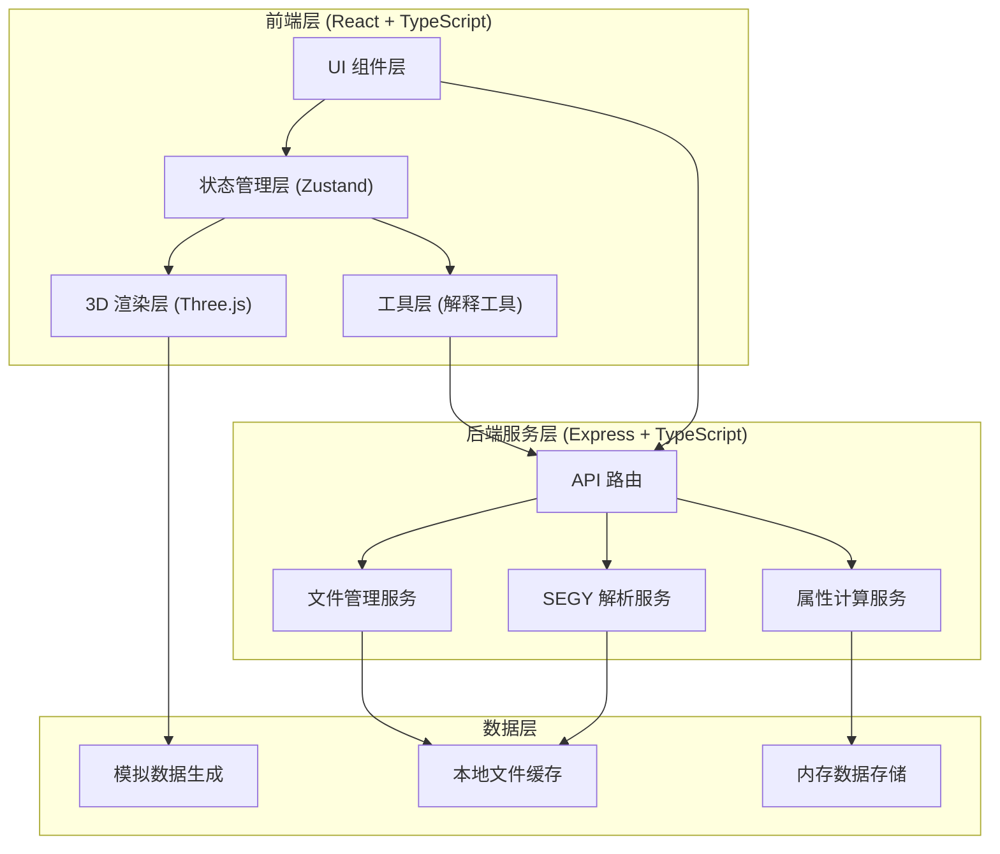
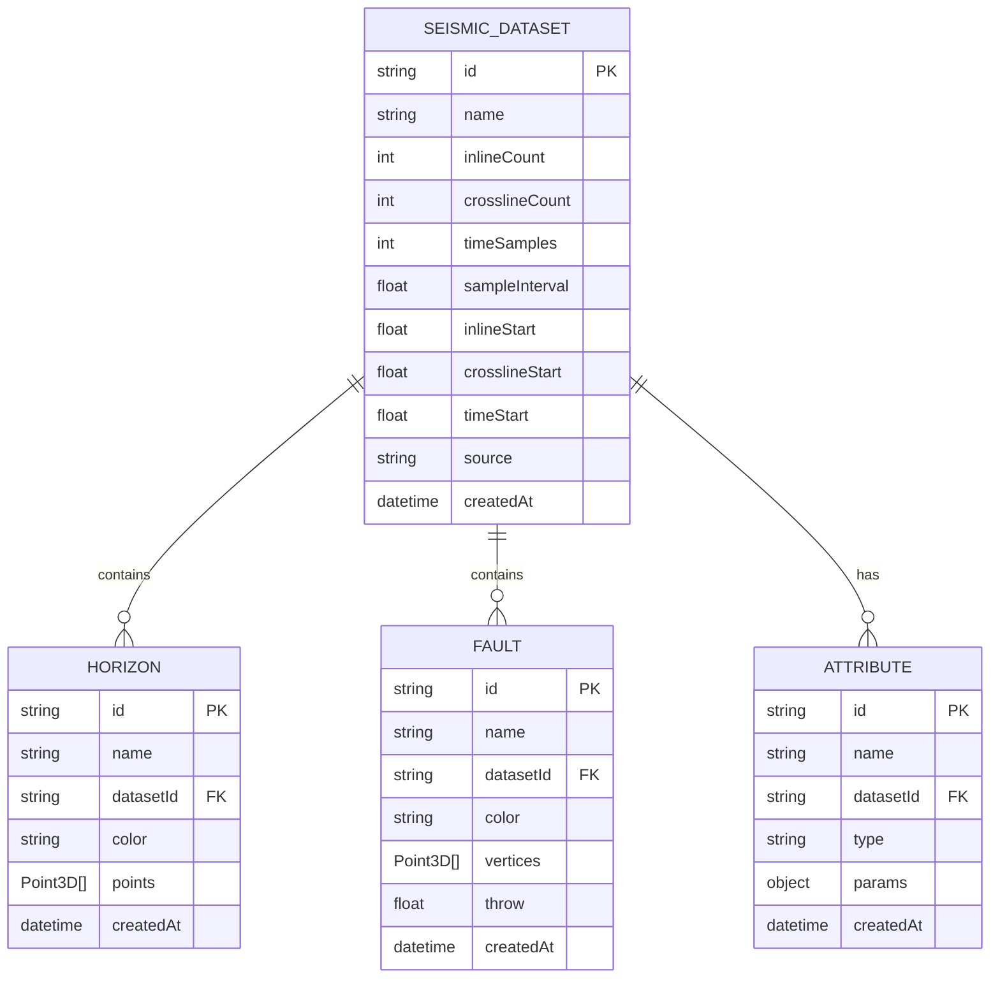

## 1. 架构设计



## 2. 技术栈说明

- **前端框架**: React 18 + TypeScript
- **构建工具**: Vite
- **样式方案**: TailwindCSS 3
- **状态管理**: Zustand
- **路由管理**: React Router DOM
- **3D 渲染**: Three.js + @react-three/fiber + @react-three/drei
- **UI 组件**: Lucide React 图标库
- **后端框架**: Express 4 + TypeScript
- **SEGY 解析**: 自定义 SEGY 二进制解析器
- **数据处理**: 纯前端模拟 + 后端计算服务

## 3. 目录结构

```
/workspace
├── src/                          # 前端源码
│   ├── components/               # 通用组件
│   │   ├── layout/              # 布局组件
│   │   │   ├── MenuBar.tsx      # 菜单栏
│   │   │   ├── ToolBar.tsx      # 工具栏
│   │   │   ├── StatusBar.tsx    # 状态栏
│   │   │   ├── LeftPanel.tsx    # 左侧面板
│   │   │   └── RightPanel.tsx   # 右侧面板
│   │   ├── viewer/              # 视图组件
│   │   │   ├── Viewer3D.tsx     # 3D 视图
│   │   │   ├── InlineView.tsx   # Inline 剖面
│   │   │   ├── CrosslineView.tsx # Crossline 剖面
│   │   │   └── TimeSliceView.tsx # 时间切片
│   │   ├── tools/               # 工具组件
│   │   │   ├── HorizonTool.tsx  # 层位工具
│   │   │   └── FaultTool.tsx    # 断层工具
│   │   └── common/              # 公共组件
│   ├── pages/                   # 页面
│   │   └── Workbench.tsx        # 主工作台
│   ├── hooks/                   # 自定义 Hooks
│   │   ├── useSeismicData.ts    # 地震数据 Hook
│   │   ├── useViewer3D.ts       # 3D 视图 Hook
│   │   └── useInterpretation.ts # 解释工具 Hook
│   ├── store/                   # 状态管理
│   │   ├── seismicStore.ts      # 地震数据 Store
│   │   ├── viewerStore.ts       # 视图 Store
│   │   └── interpretationStore.ts # 解释 Store
│   ├── utils/                   # 工具函数
│   │   ├── seismic/             # 地震数据处理
│   │   ├── colormap.ts          # 色带工具
│   │   └── segyParser.ts        # SEGY 解析
│   ├── data/                    # 模拟数据
│   │   └── mockSeismic.ts       # 模拟地震数据
│   ├── App.tsx
│   ├── main.tsx
│   └── index.css
├── api/                         # 后端源码
│   ├── routes/                  # 路由
│   │   ├── seismic.ts           # 地震数据 API
│   │   ├── segy.ts              # SEGY 上传 API
│   │   └── attributes.ts        # 属性计算 API
│   ├── services/                # 服务层
│   │   ├── segyService.ts       # SEGY 解析服务
│   │   └── attributeService.ts  # 属性计算服务
│   └── index.ts                 # 服务入口
├── shared/                      # 共享类型
│   └── types.ts                 # 类型定义
├── .trae/
│   └── documents/               # 项目文档
├── package.json
├── vite.config.ts
├── tailwind.config.js
├── tsconfig.json
└── README.md
```

## 4. 路由定义

| 路由 | 页面 | 说明 |
|------|------|------|
| / | Workbench | 主工作台页面（默认） |
| /workbench | Workbench | 主工作台页面 |

## 5. API 定义

### 5.1 地震数据 API

```typescript
// 获取模拟地震数据列表
GET /api/seismic/datasets
Response: { id: string; name: string; dimensions: {inline: number; crossline: number; time: number} }[]

// 获取地震数据切片
GET /api/seismic/slice?datasetId=xxx&type=inline|crossline|timeslice&index=xxx
Response: { data: Float32Array; width: number; height: number }

// 上传 SEGY 文件
POST /api/segy/upload
Request: multipart/form-data (file: File)
Response: { 
  success: boolean; 
  datasetId: string;
  header: {
    inlineRange: [number, number];
    crosslineRange: [number, number];
    timeRange: [number, number];
    sampleInterval: number;
  }
}

// 计算属性
POST /api/attributes/calculate
Request: { 
  datasetId: string; 
  attributeType: 'amplitude' | 'coherence' | 'curvature';
  params: Record<string, any>;
}
Response: { success: boolean; attributeId: string }
```

## 6. 数据模型

### 6.1 数据实体定义



### 6.2 核心状态模型

```typescript
// 地震数据状态
interface SeismicState {
  datasets: SeismicDataset[];
  activeDatasetId: string | null;
  dataVolume: Float32Array | null;
  dimensions: { inline: number; crossline: number; time: number };
  loadDataset: (id: string) => Promise<void>;
  uploadSegy: (file: File) => Promise<void>;
}

// 视图状态
interface ViewerState {
  viewMode: '3d' | 'inline' | 'crossline' | 'timeslice' | 'quad';
  inlineIndex: number;
  crosslineIndex: number;
  timeIndex: number;
  colormap: string;
  opacity: number;
  setViewMode: (mode: ViewerMode) => void;
  setSliceIndex: (type: SliceType, index: number) => void;
}

// 解释状态
interface InterpretationState {
  activeTool: 'select' | 'horizon' | 'fault' | 'zoom' | 'pan' | 'rotate';
  horizons: Horizon[];
  faults: Fault[];
  activeHorizonId: string | null;
  activeFaultId: string | null;
  setActiveTool: (tool: ToolType) => void;
  addHorizon: (name: string) => void;
  addFault: (name: string) => void;
}
```
